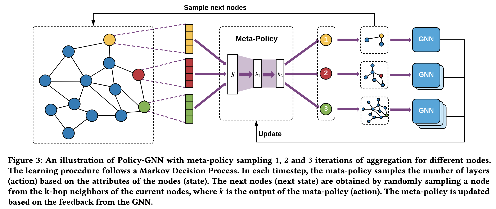

# GNN论文阅读笔记

> 这里记录了我阅读的一些GNN论文的主要思想，供后期快速回忆和头脑风暴

[toc]

## PolicyGNN

> 《Policy-GNN: Aggregation Optimization for Graph Neural Networks》

### 1. Main Idea

* **Different nodes need different iterations of aggregation**
* Some nodes could achieve better classification performance with more GNN layers

### 2. Methodology

将优化过程视为Markov决策过程，利用Deep Q-Learning (DQN)来搜索Meta-Policy。 其中，

* Meta-Policy将node attribute (节点特征向量) 作为当前的State
* 将node attribute 映射到 Action k，k为当前节点的k阶邻居
* 奖励Reward为：performance improvement on the specific task comparing with the last state.

### 3. Drawbacks 

* 这篇工作相当于让模型对每个数据集的Graph的架构进行适应，针对数据集来进行搜索，虽然针对每个数据集的准确性非常高，但是**可迁移性几乎为零**。
* 因为需要对每个节点进行决策（选择合适的k值），就算用了文章中提到的buffer和sharing weight机制，也需要**大量的时间**来进行搜索，如果将backbone网络从GCN换成更大的如GAT，那搜索时间将无法估量，因此文章中实验只有做了Cora, Pubmet, Citeseer三个相对小的数据集，大的数据集如PPI没有进行实验。
* 文章的可还原性和算法的稳定性有问题？[Github Issue](https://github.com/lhenry15/Policy-GNN/issues/7), [知乎问题](https://www.zhihu.com/question/425533509)

